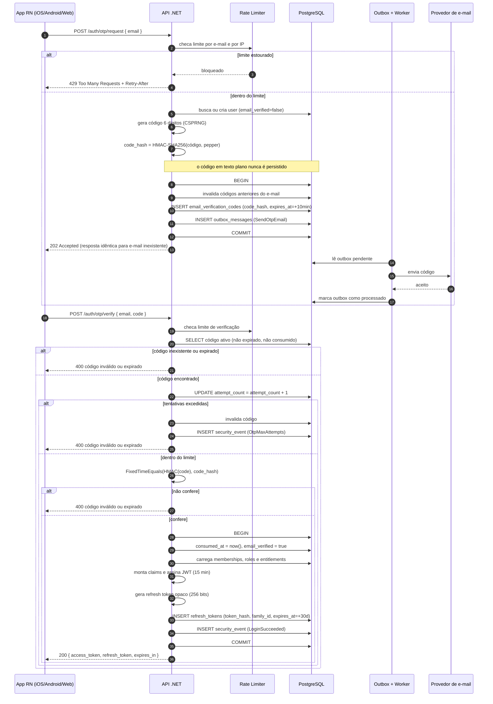
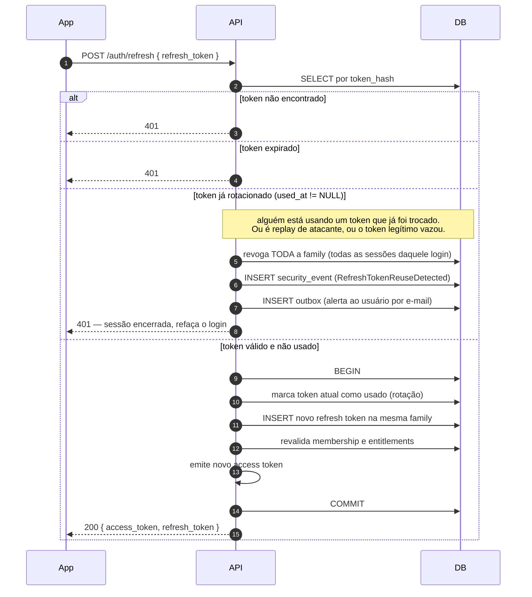

# Congrega — Fluxo de Autenticação e Segurança

> Entregável 6.2. Autenticação passwordless por OTP, emissão de JWT, refresh token com rotação e
> detecção de reuso, armazenamento por plataforma e modelo de autorização.

---

## 1. Por que passwordless por OTP

O usuário típico do Congrega é membro de igreja, não profissional de tecnologia. Senha significa
senha fraca, senha reutilizada e um fluxo de recuperação que é, ele próprio, o elo mais atacado de
qualquer sistema de autenticação. OTP por e-mail elimina a senha e, com ela, credential stuffing e
vazamento de hash.

**O custo aceito:** a segurança da conta passa a ser a segurança da caixa de e-mail do usuário, e a
entrega do e-mail vira caminho crítico — se o provedor atrasa, o usuário não entra. Mitigações no
§8 deste documento.

Para o **administrador da igreja**, que movimenta dinheiro e acessa dados de crianças, OTP isolado
é insuficiente: MFA passa a ser obrigatório na Fase 2 (§9).

---

## 2. Passo a passo do cadastro e login

### Fase A — Solicitação do código

1. O cliente envia `POST /api/v1/auth/otp/request` com `{ "email": "..." }`.
2. A API aplica **rate limit em duas dimensões antes de qualquer trabalho**:
   - por e-mail normalizado: 5 solicitações / 15 min;
   - por IP: 20 solicitações / 15 min (protege contra varredura distribuída).
   Estouro devolve `429` com `Retry-After`.
3. A API normaliza o e-mail (`trim`, lowercase) e procura o usuário.
4. **A resposta é sempre `202 Accepted`, idêntica**, exista o usuário ou não. Esta é a proteção
   contra *user enumeration* — a diferença de resposta é o que permite a um atacante montar lista
   de e-mails válidos. Pelo mesmo motivo, o tempo de resposta é uniformizado.
5. Se o usuário não existe, ele é criado com `email_verified = false`. Cadastro e login são o mesmo
   fluxo — não há tela de "criar conta" separada.
6. A API gera um código de **6 dígitos** com `RandomNumberGenerator` (CSPRNG — nunca `Random`).
7. A API grava em `email_verification_codes`:
   - `code_hash` — **hash do código, nunca o código** (`HMAC-SHA256` com pepper do secret manager;
     o espaço de 10⁶ é pequeno demais para hash simples, o pepper é o que impede rainbow table
     mesmo com o banco vazado);
   - `expires_at` = agora + **10 minutos**;
   - `attempt_count` = 0, `max_attempts` = 5;
   - `consumed_at` = NULL.
8. Códigos anteriores não consumidos do mesmo e-mail são invalidados — **um código válido por vez**.
9. O envio do e-mail **não é feito inline**: grava-se um evento no **Outbox**, na mesma transação.
   Isso garante que o código nunca exista no banco sem que o e-mail seja enviado, nem o contrário.

### Fase B — Validação do código

10. O cliente envia `POST /api/v1/auth/otp/verify` com `{ "email": "...", "code": "123456" }`.
11. Rate limit específico do endpoint: **10 tentativas / 15 min por e-mail**, mais restritivo que o
    de solicitação.
12. A API busca o código ativo. Se não existir, expirou ou já foi consumido → `400` genérico.
13. **Incrementa `attempt_count` antes de comparar.** A ordem importa: incrementar depois permite
    que uma exceção no meio do caminho zere o custo da tentativa para o atacante.
14. Se `attempt_count > max_attempts` → código invalidado e evento de segurança registrado.
15. Compara `HMAC(código_recebido)` com `code_hash` usando **comparação em tempo constante**
    (`CryptographicOperations.FixedTimeEquals`) — comparação com `==` vaza informação por timing.
16. Sucesso: `consumed_at = now()` (uso único), `email_verified = true`.
17. A API monta as claims, emite o par access + refresh e registra o evento de segurança `login`.

**Por que o bypass pelo frontend é impossível:** o frontend nunca recebe o código, nunca recebe o
hash, e nunca participa da decisão. Ele envia dois campos e recebe tokens ou erro. Não existe
resposta parcial, flag de "código correto" ou qualquer estado intermediário que um cliente
modificado pudesse forçar. A única superfície é o par (e-mail, 6 dígitos), protegido por TTL de 10
minutos, 5 tentativas e rate limit — o espaço de busca efetivo é 5 chances em 10⁶.

---

## 3. Diagrama — cadastro, OTP e emissão de token



---

## 4. Claims do JWT

Access token de **15 minutos**, assinado em **RS256** (chave assimétrica: a chave privada só existe
na API; verificadores futuros usam a pública, sem poder emitir).

```json
{
  "sub": "1337",
  "tenant_id": "42",
  "roles": ["ChurchAdmin", "CellLeader"],
  "subscription_tier": "premium_annual",
  "email_verified": true,
  "jti": "0KJ8...",
  "iss": "https://api.congrega.app",
  "aud": "congrega-app",
  "iat": 1755283200,
  "exp": 1755284100
}
```

| Claim | Origem | Observação |
|---|---|---|
| `sub` | `users.id` | Identidade global, estável e imutável |
| `tenant_id` | Membership **ativa selecionada** | Ausente para assinante Congrega+ sem igreja |
| `roles[]` | `user_roles` **no tenant selecionado** | Papéis são por tenant, nunca globais |
| `subscription_tier` | Assinatura pessoal ativa | Conveniência de UI — **não é autorização** |
| `email_verified` | `users.email_verified` | Bloqueia operações sensíveis se `false` |
| `jti` | Novo a cada emissão | Permite revogação pontual e rastreio no audit log |
| `exp` | +15 min | Curto por decisão: revogação real vem do refresh |

### Duas regras que evitam os erros mais comuns

**`subscription_tier` é dica de interface, não decisão de acesso.** A autorização de conteúdo
consulta `entitlements` no banco, sempre. Um token emitido às 10h com `premium` continua dizendo
`premium` às 10h14, mesmo se a assinatura foi cancelada às 10h05. Usar a claim para liberar
download é conceder 15 minutos de acesso indevido a cada cancelamento — e é exatamente o erro que a
skill de segurança descreve em §15 ("pagamento aprovado ≠ usuário premium").

**`tenant_id` na claim não é confiança cega.** O middleware valida, a cada requisição, que existe
`membership` ativa entre `sub` e `tenant_id`. A claim diz qual tenant o usuário *selecionou*; o
banco diz se ele *pode*. Um token com `tenant_id` adulterado quebraria na assinatura; um token
legítimo cuja membership foi revogada há dois minutos quebra nesta validação.

### Usuário em várias igrejas

O token carrega **um** `tenant_id` por vez. A troca é explícita:
`POST /auth/switch-tenant { tenant_public_id }` → valida membership → emite novo access token com o
novo `tenant_id`, **reaproveitando o mesmo refresh token e a mesma family**. Isso mantém a
autorização simples (uma requisição, um tenant) e torna trivial responder em auditoria "sob qual
tenant esta ação foi feita".

### Assinante sem igreja

Token **sem** `tenant_id` e com `roles: []`. É um cidadão de primeira classe do sistema, não um caso
de borda: ele acessa todo o Congrega+ e nada do ChMS. Toda policy de tenant exige `tenant_id`
presente, então esse usuário é naturalmente barrado das áreas de igreja sem nenhum tratamento
especial.

---

## 5. Refresh token: rotação e detecção de reuso

O access token é curto e não revogável; a segurança da sessão está no refresh.

**Formato:** valor **opaco** de 256 bits (`RandomNumberGenerator`), nunca um JWT. Um JWT de refresh
seria autocontido e, portanto, não revogável sem lista negra — o oposto do que se quer aqui.

**Persistência:** apenas `SHA-256` do token. O banco vazado não permite autenticar.

**Rotação:** todo uso invalida o token atual e emite um novo. Um refresh token vale exatamente uma
vez.

**Family:** todos os tokens descendentes de um mesmo login compartilham `family_id`. É o que permite
detectar roubo.

### O algoritmo de detecção de reuso



**Por que revogar a family inteira, e não só o token reutilizado:** se um token já rotacionado
aparece de novo, existem duas possibilidades — o atacante roubou e está usando, ou o usuário
legítimo repetiu por falha de rede enquanto o atacante já rodou. Em ambos os casos **não há como
distinguir quem é quem**. A escolha conservadora é derrubar a sessão inteira e forçar novo login: o
custo para o usuário legítimo é um login; o custo de errar para o outro lado é a conta comprometida.

**TTL:** 30 dias com rotação deslizante. Inatividade de 30 dias exige novo OTP.

**Revogação explícita:** logout revoga o token atual; "sair de todos os dispositivos" revoga todas
as families do usuário.

---

## 6. Onde os tokens ficam, por plataforma

O briefing é categórico e a skill de segurança (§36) concorda: **nunca `AsyncStorage`**, que é
texto plano no sandbox do app e legível em dispositivo comprometido ou em backup não criptografado.

| Plataforma | Access token | Refresh token | Mecanismo |
|---|---|---|---|
| **iOS** | Memória | Keychain | `expo-secure-store` (`WHEN_UNLOCKED_THIS_DEVICE_ONLY`) |
| **Android** | Memória | Keystore | `expo-secure-store` (EncryptedSharedPreferences) |
| **Web** | Memória | **Cookie `HttpOnly`** | Definido pelo servidor; JS nunca o alcança |

**Access token em memória, sempre.** Ele vive 15 minutos; persistir cria superfície sem benefício.
Ao reabrir o app, o refresh reidrata a sessão.

**No web, o refresh vai em cookie e não em `localStorage`.** `localStorage` é legível por qualquer
XSS; cookie `HttpOnly` não é. Atributos obrigatórios:

```
Set-Cookie: congrega_rt=<opaco>;
    HttpOnly; Secure; SameSite=Strict; Path=/api/v1/auth; Max-Age=2592000
```

`Path` restrito faz o cookie viajar só nos endpoints de auth, reduzindo exposição. `SameSite=Strict`
elimina a maior parte do vetor CSRF; o endpoint de refresh ainda valida `Origin` e exige header
`X-Requested-With` como defesa adicional — CORS não é mecanismo de autenticação (§37).

**A divergência é isolada em um único arquivo**, conforme a estratégia da skill de React Native:

```
packages/api-client/src/token-storage/
  index.ts          # interface TokenStorage
  index.native.ts   # SecureStore
  index.web.ts      # no-op de leitura: o cookie é gerido pelo browser
```

Nenhum outro ponto do código sabe onde o token mora.

---

## 7. Autorização: RBAC + policy-based

**RBAC puro não resolve este domínio.** A pergunta que o sistema precisa responder não é "qual o
papel do usuário?", é "**este usuário pode fazer esta operação neste recurso deste tenant, agora?**".
Papel é só uma das entradas.

Três dimensões independentes, e confundi-las é a falha de autorização mais provável do projeto:

```
Identidade    → quem é         (users)
Pertencimento → onde atua      (memberships → roles → permissions)
Direito       → o que consome  (entitlements)
```

A skill de segurança (§7) diz textualmente: `PremiumSubscriber` **não** implica
`ChurchAdministrator`. E a recíproca também vale — administrador de igreja não recebe conteúdo
premium de graça. São eixos ortogonais.

### Composição

| Conceito | Exemplo | Origem |
|---|---|---|
| Role | `ChurchAdmin`, `Treasurer`, `CellLeader`, `Member` | `user_roles` (por tenant) |
| Permission | `members.read`, `giving.write`, `children.checkout` | `role_permissions` |
| Policy | permission **+** tenant **+** posse do recurso **+** estado | Código |
| Entitlement | acesso a um pack, curso ou tier | `entitlements` |

### Policies como código

```csharp
// Program.cs
builder.Services.AddAuthorizationBuilder()
    .AddPolicy("Members.Read", p => p
        .RequireAuthenticatedUser()
        .AddRequirements(
            new EmailVerifiedRequirement(),
            new TenantScopedRequirement(),          // tenant_id presente e membership ativa
            new PermissionRequirement("members.read")))

    .AddPolicy("Children.Checkout", p => p
        .RequireAuthenticatedUser()
        .AddRequirements(
            new EmailVerifiedRequirement(),
            new TenantScopedRequirement(),
            new PermissionRequirement("children.checkout"),
            new ActiveEventRequirement()))          // só durante evento aberto

    .AddPolicy("Premium.Content", p => p
        .RequireAuthenticatedUser()
        .AddRequirements(
            new EntitlementRequirement()));         // consulta entitlements, ignora roles
```

Note que `Premium.Content` **não exige tenant nem role**. É o que permite ao assinante sem igreja
consumir conteúdo, e o que impede o administrador de igreja de consumi-lo sem assinar.

### Posse do recurso é verificada sempre

Permissão concede a *classe* da operação; a *instância* é verificada no handler:

```csharp
// Nunca basta: usuário tem "members.read" → devolve o membro pedido.
var member = await _members.GetForTenantAsync(memberId, ctx.TenantId, ct);
if (member is null) return TypedResults.NotFound();  // 404, não 403 — não confirma existência
```

Devolver `404` em vez de `403` é deliberado: `403` confirmaria ao atacante que o recurso existe em
outro tenant, o que é vazamento de informação por si só. Esta é a defesa direta contra o
IDOR/BOLA descrito no ADR de chaves públicas (D1).

---

## 8. Ameaças tratadas neste fluxo

Formato exigido pela skill de segurança (§4): ameaça → vetor → controle preventivo → detecção →
risco residual.

| Ameaça | Vetor | Prevenção | Detecção | Residual |
|---|---|---|---|---|
| Força bruta de OTP | Requisições em massa no verify | 6 dígitos + 5 tentativas + TTL 10 min + rate limit | `security_event` de tentativas excedidas | 🟢 5 em 10⁶ |
| Enumeração de usuários | Diferença de resposta ou de tempo | Resposta e latência idênticas | Volume anômalo por IP | 🟢 Baixo |
| Roubo de refresh token | Malware, XSS, backup | Keychain/Keystore, cookie `HttpOnly`, hash no banco | **Detecção de reuso por family** | 🟡 Janela até o primeiro reuso |
| Replay de access token | Interceptação | TLS, TTL de 15 min, `jti` | Auditoria por `jti` | 🟡 Até 15 min |
| Escalação horizontal (IDOR) | Trocar ID na URL | `public_id` opaco + verificação de posse + RLS | Auditoria de 404 em sequência | 🟢 Baixo |
| Escalação vertical | Forjar `roles` na claim | Assinatura RS256; papéis revalidados no refresh | Auditoria de mudança de papel | 🟢 Baixo |
| XSS no web roubando sessão | Script injetado | Cookie `HttpOnly` + CSP restritiva | Relatório de violação de CSP | 🟡 Access token em memória é alcançável |
| CSRF no refresh | Site malicioso | `SameSite=Strict` + validação de `Origin` | — | 🟢 Baixo |
| **Bounce silencioso de e-mail** | Provedor rejeita | Webhook de bounce marca e-mail inválido; canal alternativo | Alerta de taxa de entrega | 🟡 Usuário travado até suporte |
| Comprometimento da caixa de e-mail | Fora do nosso perímetro | MFA obrigatório para papéis sensíveis (Fase 2) | Alerta de login de novo dispositivo | 🔴 **Aceito no MVP** |

O último item é o risco estrutural do passwordless e precisa estar consciente na decisão: **quem
controla o e-mail controla a conta**. Para membro comum, é proporcional. Para tesoureiro e
administrador, não é — daí MFA obrigatório para esses papéis na Fase 2.

---

## 9. Não implementado no MVP, e por quê

| Item | Fase | Motivo |
|---|---|---|
| MFA (TOTP) para papéis administrativos | **Fase 2** | Necessário antes de escalar o módulo financeiro |
| Login social (Google/Apple) | Fase 2 | Reduz atrito; Sign in with Apple é **obrigatório** no iOS se houver outro login social |
| Gerenciamento de dispositivos/sessões | Fase 2 | Depende de volume real para justificar a UI |
| Detecção de login anômalo (geo/dispositivo) | Fase 3 | Requer histórico acumulado para ter sinal |
| Certificate pinning | Fase 3 | A skill (§36) só recomenda com threat model que justifique; sem isso é *security theater* |
