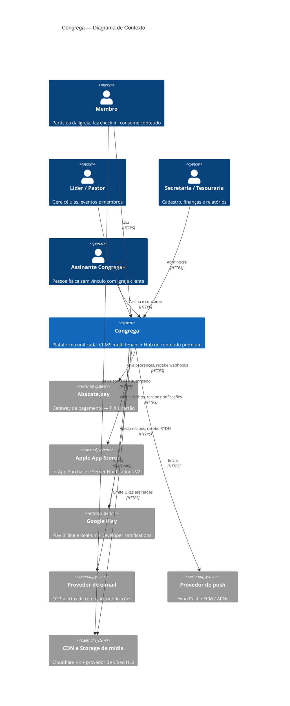
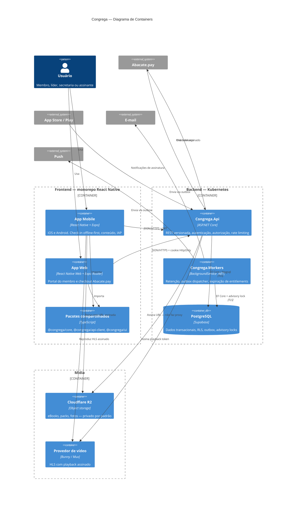
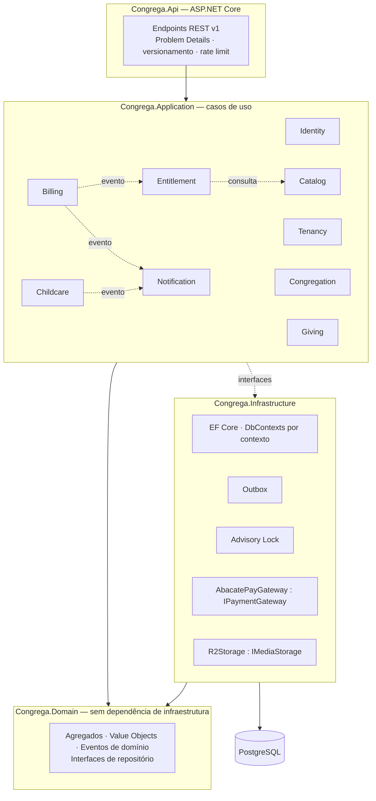
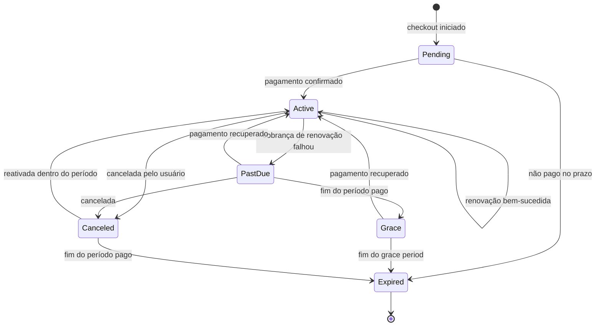

# Congrega — Desenho Arquitetural

> Entregável 6.3. Diagramas C4 (Contexto e Container), caminho completo de uma requisição,
> e o fluxo de checkout com webhook de ponta a ponta.

---

## 1. Contexto (C4 nível 1)



A seta que mais importa neste diagrama é a última: **o membro baixa direto do CDN**, não através da
API. A API autoriza e assina; ela nunca faz proxy de bytes. É o que mantém o custo de banda da
aplicação próximo de zero e permite escalar entrega e API separadamente.

---

## 2. Containers (C4 nível 2)



**Dois processos, um banco.** A separação API/worker é deliberada: cargas com perfis opostos
(latência baixa e picos curtos vs. throughput e execução longa) escalam por critérios diferentes, e
um worker travado não deve derrubar o atendimento HTTP. É o menor grau de distribuição que resolve
um problema real — coerente com a §45 da skill de segurança.

---

## 3. Bounded contexts e a estrutura da solution



**A seta pontilhada de `Application` para `Infrastructure` é a inversão de dependência.** A
aplicação declara `ISubscriptionRepository`; a infraestrutura implementa. Em tempo de compilação,
`Domain` não referencia nada — nem EF Core, nem ASP.NET, nem Npgsql. É essa restrição que separa
Clean Architecture real do que o briefing chama de "monólito com 4 pastas".

### Estrutura de arquivos

```
Congrega.sln
├── src/
│   ├── Congrega.Domain/                 # sem dependências externas
│   │   ├── Common/                      # Entity, AggregateRoot, IDomainEvent
│   │   ├── Identity/
│   │   ├── Tenancy/
│   │   ├── Billing/                     # Subscription, Plan, máquina de estados
│   │   ├── Entitlements/
│   │   └── Notifications/
│   ├── Congrega.Application/            # casos de uso, interfaces de porta
│   │   ├── Abstractions/                # IUnitOfWork, IOutbox, IDateTimeProvider
│   │   ├── Billing/
│   │   └── Retention/                   # o motor de retenção (entregável 6.5)
│   ├── Congrega.Infrastructure/         # EF Core, adaptadores, gateway
│   │   ├── Persistence/
│   │   ├── Outbox/
│   │   ├── Locking/
│   │   └── Payments/
│   ├── Congrega.Api/                    # ASP.NET Core
│   └── Congrega.Workers/                # BackgroundServices
└── tests/
    ├── Congrega.Domain.UnitTests/
    ├── Congrega.Application.UnitTests/
    └── Congrega.Integration.Tests/      # Testcontainers + Postgres real
```

---

## 4. O caminho de uma requisição — do toque à tabela

Exemplo concreto: **a secretária abre a lista de membros da igreja**.

1. **Toque na tela.** `MembersScreen.tsx` monta e o TanStack Query dispara
   `useQuery(['members', tenantId, page])`. Se houver dado em cache não expirado, a lista aparece
   **antes** de qualquer rede — o `staleTime` é o que faz o app parecer rápido.
2. **Cliente HTTP.** `@congrega/api-client` monta `GET /api/v1/members?page=1&pageSize=50`,
   anexa `Authorization: Bearer <access_token>` e gera `X-Correlation-Id` (ULID) — o mesmo
   identificador vai atravessar todas as camadas até o banco.
3. **Token expirado?** O interceptor detecta `exp` vencido, chama `/auth/refresh` **uma única vez**
   (requisições concorrentes aguardam a mesma promise, evitando tempestade de refresh) e repete a
   requisição original.
4. **Ingress / WAF.** TLS termina no ingress. Rate limiting de borda e regras de WAF aplicam antes
   de qualquer código nosso rodar.
5. **Middleware de correlação.** Lê `X-Correlation-Id`, abre um escopo de log do Serilog e o
   `Activity` do OpenTelemetry. A partir daqui, **todo log carrega o mesmo identificador**.
6. **Autenticação.** `JwtBearer` valida assinatura RS256, `iss`, `aud`, `exp`, `nbf` e algoritmo.
   Falhou → `401` com Problem Details.
7. **Contexto de tenant.** `TenantContextMiddleware` lê `tenant_id` da claim e **valida contra
   `memberships`** (com cache de 60 s). Membership revogada → `403`. Popula `ITenantContext`,
   injetado por escopo de requisição.
8. **Autorização.** A policy `Members.Read` roda os requirements: e-mail verificado, tenant válido,
   permissão `members.read`. Falhou → `403`.
9. **Endpoint.** Valida query string (`page ≥ 1`, `pageSize ≤ 100` — limite obrigatório, senão
   `pageSize=100000` vira DoS gratuito) e despacha `ListMembersQuery`.
10. **Handler.** Monta a projeção — `AsNoTracking()` e `Select` direto para DTO. Entidade de domínio
    **não** vira resposta de API; sem isso, um campo novo no domínio vaza para o contrato público
    sem ninguém decidir.
11. **EF Core.** Aplica o Global Query Filter `e => e.TenantId == _tenant.TenantId`
    automaticamente. Nenhum handler escreve `WHERE tenant_id` à mão — se escrever, é sinal de que
    algo saiu do trilho.
12. **Interceptor de conexão.** Antes do comando, emite `SET LOCAL app.tenant_id = 42`.
13. **PostgreSQL.** Executa com **duas** barreiras ativas: o `WHERE` do filtro e a policy de RLS.
    Se o passo 11 tivesse falhado, o passo 13 devolveria zero linhas em vez de vazar.
14. **Resposta.** DTO paginado com `X-Correlation-Id` no header. Erro? `application/problem+json`
    conforme RFC 7807, sem stack trace e sem detalhe interno.
15. **De volta ao app.** TanStack Query cacheia por chave e a lista renderiza em `FlashList` —
    `ScrollView` com 800 membros é jank garantido, conforme a skill de performance.

---

## 5. Checkout e webhook — o fluxo completo

Este é o caminho onde um erro custa dinheiro real ou concede acesso indevido. Duas propriedades
inegociáveis: **idempotência** e **o webhook nunca é fonte de verdade sozinho**.

```mermaid
sequenceDiagram
    autonumber
    participant App as App / Web
    participant API as Congrega.Api
    participant DB as PostgreSQL
    participant AB as Abacate.pay
    participant WK as Workers (Outbox)
    participant U as Usuário

    rect rgb(240, 246, 255)
    Note over App,AB: 1. Criação da cobrança
    App->>API: POST /billing/checkout { planId, Idempotency-Key }
    API->>DB: SELECT payment por idempotency_key
    alt já existe
        DB-->>API: pagamento anterior
        API-->>App: 200 — mesma resposta, nada duplicado
    else primeira vez
        API->>DB: BEGIN
        API->>DB: INSERT subscription (status = Pending)
        API->>DB: INSERT payment (status = Pending, idempotency_key)
        API->>DB: COMMIT
        API->>AB: cria cobrança (via IPaymentGateway)
        AB-->>API: { chargeId, checkoutUrl }
        API->>DB: UPDATE payment SET gateway_charge_id
        API-->>App: 201 { checkoutUrl }
    end
    end

    App->>U: abre checkout no navegador
    U->>AB: paga (PIX ou cartão)

    rect rgb(255, 247, 237)
    Note over AB,DB: 2. Webhook — entrada não confiável
    AB->>API: POST /webhooks/abacatepay (assinado)
    API->>API: valida HMAC em tempo constante
    alt assinatura inválida
        API->>DB: INSERT security_event (WebhookSignatureInvalid)
        API-->>AB: 401
    else válida
        API->>API: valida timestamp (janela de 5 min — anti-replay)
        API->>DB: INSERT payment_webhooks (provider_event_id UNIQUE)
        alt violação de unique
            Note over API,DB: webhook duplicado — o banco garante,<br/>não um "if exists" em código
            API-->>AB: 200 OK (idempotente)
        else evento novo
            API->>DB: COMMIT (evento cru persistido)
            API-->>AB: 200 OK
            Note over API,AB: responde rápido; processamento é assíncrono
        end
    end
    end

    rect rgb(240, 253, 244)
    Note over WK,U: 3. Processamento assíncrono
    WK->>DB: SELECT webhooks não processados FOR UPDATE SKIP LOCKED
    WK->>AB: consulta status real da cobrança (fetch-on-notify)
    Note over WK,AB: o webhook diz "olhe"; a API do gateway diz "o quê".<br/>Protege mesmo se o HMAC for comprometido.
    AB-->>WK: status confirmado
    WK->>DB: BEGIN
    WK->>DB: UPDATE payment → Paid
    WK->>DB: Subscription.Activate() — transição validada
    WK->>DB: INSERT subscription_events (auditoria)
    WK->>DB: INSERT entitlements (acesso efetivo)
    WK->>DB: INSERT outbox (SubscriptionActivated)
    WK->>DB: UPDATE payment_webhooks SET processed_at
    WK->>DB: COMMIT
    WK->>U: e-mail e push de confirmação (via outbox)
    end
```

### As cinco decisões que sustentam esse fluxo

1. **`Idempotency-Key` no checkout.** Duplo toque no botão em 3G ruim não cria duas assinaturas.
2. **Persistir o evento cru antes de processar.** Se o processamento falhar, o evento está salvo e
   pode ser reprocessado. Perder um webhook de pagamento é perder dinheiro.
3. **`UNIQUE (provider, provider_event_id)` faz a deduplicação.** Não um `if (!exists) create()`,
   que é *race condition* documentada na §14 da skill de segurança. Em ambiente concorrente,
   correção vem de constraint, não de verificação prévia.
4. **`fetch-on-notify`.** O webhook é gatilho; o estado autoritativo vem de uma consulta à API do
   gateway. É o controle que mantém o sistema seguro mesmo sob a incerteza da premissa P1 — se o
   Abacate.pay não assinar webhooks, esta é a defesa que resta.
5. **Ativar assinatura ≠ conceder acesso.** A ativação **gera entitlements**; a autorização consulta
   entitlements. Um único caminho de resolução de acesso, independente de a origem ser Abacate.pay,
   Apple, Google ou cortesia.

---

## 6. Máquina de estados da assinatura



Transições são **validadas no agregado**, não no handler. `Subscription.Activate()` a partir de
`Expired` lança `InvalidSubscriptionTransitionException`. Um webhook fora de ordem — que acontece —
não corrompe o estado.

Detalhe importante: `Canceled` **não** revoga acesso imediatamente. O usuário cancelou mas pagou até
o dia 30; `entitlements` continua válido até lá. Confundir "cancelou" com "perdeu acesso" gera
reclamação e chargeback.

O motor de retenção age em `Active` (D-15 a D-1) e em `Grace` (D+3) — implementação no
entregável 6.5.

---

## 7. Observabilidade

**Correlation ID atravessando toda a pilha**, conforme exigido:

```
App RN                → gera ULID em X-Correlation-Id
  ↓
API                   → escopo Serilog + Activity OpenTelemetry
  ↓
Application/Domain    → herda o escopo, sem passar parâmetro
  ↓
PostgreSQL            → application_name = "congrega-api:{correlationId}"
  ↓
Serviços externos     → propagado no header
  ↓
Outbox                → correlation_id persistido na mensagem
  ↓
Worker                → restaura o escopo ao processar
```

A última parte é a que costuma faltar: um e-mail enviado dez minutos depois pelo worker continua
rastreável até o toque que o originou.

| Sinal | Ferramenta | Observação |
|---|---|---|
| Logs | Serilog estruturado, JSON | **Nunca** token, OTP, senha ou dado de criança (§28) |
| Traces | OpenTelemetry → OTLP | Instrumentação de ASP.NET Core, Npgsql e HttpClient |
| Métricas | OpenTelemetry | Latência, taxa de erro, fila do outbox, duração do ciclo de retenção |
| Health | `/health/live`, `/health/ready` | Readiness checa Postgres; liveness não — senão o banco cair reinicia todos os pods |

Essa distinção entre liveness e readiness é sutil e cara quando errada: banco indisponível deve
tirar os pods do balanceamento, não entrar em loop de reinício.

### Alertas que importam

| Alerta | Limiar | Por quê |
|---|---|---|
| Webhooks não processados | > 50 ou > 15 min | Dinheiro parado, acesso não concedido |
| Fila do outbox crescendo | > 1.000 | Notificações não saindo |
| Falha de assinatura de webhook | qualquer | Tentativa de forja |
| Reuso de refresh token | qualquer | Possível conta comprometida |
| Retirada infantil com código inválido | qualquer | **O alerta mais importante do sistema** |
| Egress de mídia acima do previsto | > 120% do baseline | Abuso ou vazamento de URL |
