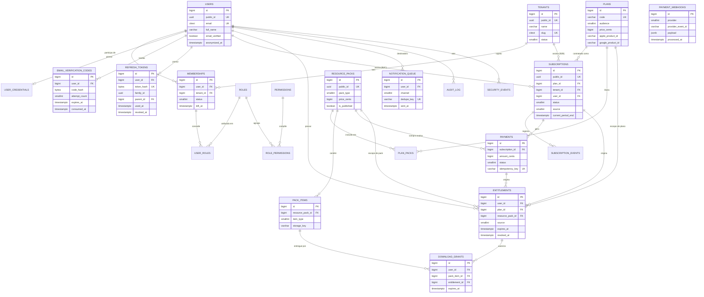

# Congrega — Modelagem de Dados

> Entregável 6.4. DDL completo, comentado e com justificativa de cada índice em
> [`db/schema.sql`](../db/schema.sql). Este documento traz o diagrama e as decisões
> que a leitura do SQL sozinha não explicaria.

---

## 1. Diagrama entidade-relacionamento



---

## 2. As três decisões estruturais do modelo

### 2.1 `users` não tem `tenant_id`

É a decisão que sustenta o requisito de primeira classe do briefing. Identidade é **global**;
pertencimento é **contextual**, expresso em `memberships`.

Se `users` tivesse `tenant_id`:

- a mesma pessoa em duas igrejas viraria duas contas, com dois logins e dois históricos;
- o assinante Congrega+ sem igreja não teria onde existir — precisaria de um tenant fictício, que
  contaminaria toda query de relatório;
- mudar de igreja destruiria o vínculo com dízimos e presenças anteriores.

**Custo aceito:** nenhuma query de membro pode partir só de `user_id`. Sempre o par
`(user_id, tenant_id)`, via `memberships`. Isso é chato de lembrar — e é exatamente por isso que
existe o Global Query Filter do EF Core, mais o RLS como rede.

### 2.2 `entitlements` é o único caminho de autorização de conteúdo

O briefing pergunta como o entitlement resolve acesso vindo de origens diferentes. A resposta está
em duas colunas mutuamente exclusivas e uma coluna de origem:

| Origem (`source`) | Preenche | Expira | Cenário |
|---|---|---|---|
| `1 Subscription` | `plan_id` | Fim do período pago | Assinante Congrega+ mensal ou anual |
| `2 OneOffPurchase` | `resource_pack_id` | `NULL` — perpétuo | Comprou um pack de sermões na web |
| `3 Courtesy` | qualquer um | Definido pelo admin | Pastor ganhou acesso na conferência |
| `4 IAP` | qualquer um | Conforme a loja | Comprou dentro do app iOS |

E uma única query responde por todas elas:

```sql
SELECT EXISTS (
    SELECT 1
      FROM entitlements e
      LEFT JOIN plan_packs pp ON pp.plan_id = e.plan_id
     WHERE e.user_id = :userId
       AND e.revoked_at IS NULL
       AND (e.expires_at IS NULL OR e.expires_at > now())
       AND (e.resource_pack_id = :packId OR pp.resource_pack_id = :packId)
);
```

Três propriedades que vêm de graça com esse desenho:

1. **Nenhum `if` por fornecedor no caminho de autorização.** Apple, Google, Abacate.pay e cortesia
   convergem antes de chegar à decisão de acesso.
2. **Conteúdo novo entra automaticamente** para quem tem entitlement de plano — basta inserir em
   `plan_packs`. Não há backfill de milhares de linhas a cada lançamento.
3. **Reembolso e chargeback são reversíveis com precisão**: `revoked_at` + `revoked_reason` no
   entitlement originado por aquele pagamento, sem tocar em nada mais.

**O que isso impede:** o erro descrito na §15 da skill de segurança — tratar "pagamento aprovado"
como "usuário premium". Pagamento move a assinatura; assinatura concede entitlement; entitlement
autoriza. Três passos, não um.

### 2.3 Deduplicação mora em constraint, não em código

`notification_queue.dedupe_key` é `UNIQUE`, no formato:

```
retention:{subscriptionId}:{periodEnd:yyyy-MM-dd}:{window}
  ex.: retention:9182:2026-09-01:D7
```

O requisito do briefing — *"um mesmo usuário não recebe o mesmo alerta duas vezes"* — é garantido
pelo **banco**. Três réplicas do worker rodando simultaneamente produzem uma inserção bem-sucedida e
duas violações de unique, tratadas como no-op.

Incluir `periodEnd` na chave é o detalhe que faz a coisa funcionar ao longo do tempo: sem ele, a
assinatura renovada nunca receberia alerta de novo, porque a chave do ciclo anterior já ocuparia o
lugar para sempre.

---

## 3. Índices — os cinco que importam

O arquivo DDL justifica todos. Estes são os que decidem a performance do sistema:

| Índice | Tabela | Serve a | Por que composto/parcial |
|---|---|---|---|
| `ix_sub_retention` | `subscriptions` | Varredura do motor de retenção | `(status, current_period_end)` com `WHERE status IN (2,3,4)`. A varredura filtra exatamente por isso; sem o parcial, o índice carregaria assinaturas expiradas, que são a maioria após um ano |
| `ix_ent_user_active` | `entitlements` | Autorização de conteúdo | Caminho mais quente do sistema. Parcial em `revoked_at IS NULL` — revogado nunca é consultado |
| `uq_webhook_event` | `payment_webhooks` | Idempotência | `UNIQUE (provider, provider_event_id)`. Não é otimização, é **correção** |
| `uq_sub_active_user` | `subscriptions` | Impedir assinatura dupla | UNIQUE parcial em status ativos. Permite histórico de assinaturas expiradas, proíbe duas vigentes |
| `ix_outbox_pending` | `outbox_messages` | Dispatcher | Parcial em `processed_at IS NULL`. A tabela cresce para sempre; o índice não |

O padrão que se repete: **índice parcial onde a query sempre filtra por um subconjunto pequeno de
uma tabela que cresce sem parar**. É o que mantém a latência estável no segundo ano de operação, e
não apenas na demo.

---

## 4. Integridade referencial: onde `CASCADE` e onde `RESTRICT`

Escolha deliberada, não padrão do gerador:

| Relação | Ação | Motivo |
|---|---|---|
| `user_credentials` → `users` | `CASCADE` | Credencial sem usuário não significa nada |
| `refresh_tokens` → `users` | `CASCADE` | Idem |
| `memberships` → `tenants` | `CASCADE` | Igreja encerrada, vínculos encerrados |
| **`payments` → `users`** | **`RESTRICT`** | **Apagar usuário jamais pode apagar histórico financeiro** |
| **`payments` → `subscriptions`** | **`RESTRICT`** | Idem |
| `subscriptions` → `plans` | `RESTRICT` | Plano descontinuado não pode sumir com quem o assinou |
| `user_roles` → `roles` | `RESTRICT` | Apagar papel em uso deve falhar ruidosamente |
| `entitlements` → `subscriptions` | `SET NULL` | O direito sobrevive à assinatura que o originou (ex.: cortesia convertida) |

As linhas `RESTRICT` em `payments` são a tradução em SQL do ADR-015: a exclusão de um titular
**anonimiza** `users`, nunca executa `DELETE`. Se alguém tentar o `DELETE`, o banco recusa — o
controle não depende de o desenvolvedor lembrar da regra.

---

## 5. O que ficou fora deste DDL

Tabelas do módulo de gestão (`members`, `families`, `cells`, `events`, `children`, `checkins`,
`giving_entries`, `giving_categories`) não foram escritas aqui por decisão de **profundidade sobre
cobertura**, conforme a Seção 7 do briefing. Elas são CRUD tenant-scoped bem comportado, sem as
decisões estruturais difíceis que justificam espaço neste documento.

Duas exceções que exigem atenção quando forem escritas, e que já estão decididas:

- **`children`** — recebe `public_id UUID` obrigatório (D1), colunas de alergia e foto
  criptografadas na aplicação, e `checkout_code_hash` com TTL e uso único. Nunca ID sequencial em
  etiqueta impressa.
- **`giving_entries`** — FK para `member_id` com `RESTRICT`, jamais PII direta na linha do
  lançamento. É o que torna a anonimização possível sem quebrar o fechamento contábil.
